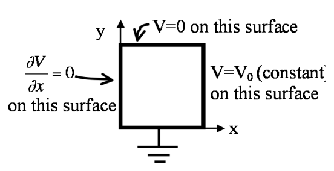

Homework 7 focuses on Laplace's equations and solving it using infinite series solutions. You should become comfortable with setting boundary conditions for PDE problems like this and develop a sense of the process for solving these problems analytically. Additionaly, you will plot these solutions in 2D and develop the method of relaxation in 1D to investigate issues with the method.

[Dropbox file request link for Homework 7](https://www.dropbox.com/request/ReuOdcuKjvoLvVZok72Z)

## 1. Potential and electric field with Laplace's equation

In class we derived the solution for the 2D version of Laplace's equation with the boundary conditions shown below.


That solution was analytic, but it contained an infinite series:

$$V(x,y) = \sum_{n=1,3,5,\dots}^{\infty} \dfrac{4 V_0}{\pi n} \sin \left(\dfrac{n\pi x}{a}\right)e^{-\dfrac{n\pi y}{a}}$$


While perfectly analytic, this solution is hard to visualize. What does that solution look like? Take $V_0 = 10V$ and $a = 1m$.

1. Plot the approximate solution in 3D space using Python's ```mplot3D``` for just the first term in the sum (i.e., only for $n = 1$). Download this [Jupyter notebook](../jupyter/HW7-3dPotentialPlot.ipynb) (you can [view it here](https://github.com/dannycab/phy481msu_f2017/blob/master/jupyter/HW7-3dPotentialPlot.ipynb)), which walks you through how to plot in 3D.
2. Plot the approximate solution in 3D space for the first 5 terms. What do you notice about the boundary where $V=V_0$?
3. Plot the approximate solution such that the boundary where $V=V_0$ looks very close to constant. How many terms did you need? If you didn't do it for Part 2, you will have to figure out how to automatically compute each term to construct your plot instead of copying-and-pasting 50, or 100, or 1000 times!
4. Given this plot of the potential, sketch (by hand) what the electric field looks like. Recall that $\mathbf{E} = -\nabla V$.


## 2. Potential in a cubical box

You have a cubical box (sides all of length $a$) made of 6 metal plates that are insulated from each other. The left wall is located at $x=-a/2$ and the right wall is at $x=+a/2$. Both left and right walls are held at constant potential $V=V_0$. All four other walls are grounded ($V=0$ for these walls).

(Note that we've set up the geometry so the cube runs from $y=0$ to $y=a$, and from $z=0$ to $z=a$,  but from $x=-a/2$ to $x=+a/2$  This should actually make the math work out a little easier!)

1. Find the potential $V(x,y,z)$ everywhere inside the box.
2. Also, is V=0 at the center of this cube?
3. Is E=0 there? Why, or why not?

## 3. Separation of variables - Cartesian 2D with new Boundary Conditions

A square rectangular pipe (sides of length $a$) runs parallel to the z-axis (from $-\infty$ to $\infty$)  The 4 sides are maintained with boundary conditions given in the figure. (Each of the 4 sides is insulated from the others at the corners).




1. Find the potential $V(x,y,z)$ at all points in this pipe.
2. Sketch the E-field lines and equipotential contours inside the pipe. (Also, state in words what the boundary condition on the left wall means - what does it tell you? Is the left wall a conductor?)
3. Find the charge density $\sigma(x,y=0,z)$ everywhere on the bottom conducting wall $(y=0)$.

## 4. Reminders about Gauss' Law

Consider a hypothetical sphere of charge with radius $a$. The charge density for this $\rho(r) = \frac{c}{\sqrt{r}}$.

1. Using Gauss' Law find the electric field inside and outside there sphere. What are the units of $c$?
2. Why would would use Gauss' Law for this problem and not directly integrate the charge density or find $\mathbf{E}$ or $V$?
3. What if the charge density were $\rho(r,\phi) = \frac{c}{\sqrt{r}}\sin(\phi)$? What approach might you use here? *You do not have to solve this problem, we will find a way to solve problems like it approximately in the ''far field'' limit later.*

## 5. Method of relaxation in 1D

In this problem, you will write a 1D method of relaxation solver for Laplace's equation. Your solver should start with boundary conditions (e.g., $V(0) = 0$ and $V(1) = 1$) and then use the method of relaxation to develop a linear solution (as we know the analytical solution). This might seem silly, but it will be clearly important to know this method well in 2D. Secondly, you will investigate what happens when you make bad initial guesses. At this point, you have written a several different codes for this class. So, for this problem, I will not provide a notebook, but ask that you write your own. I will, however, remind you of the pseudocode that we developed in class.

* Cut up the space into equal size bins (called the mesh) of size $a$
* Set the boundary conditions at V(left side) and V(right side)
* Make some reasonable guess for all the values in between
* Set a maximum number of iterations (just in case)
* For each value NOT at the boundary (careful here) set it equal to average of the surrounding two points
  - Compute the error (e.g., the difference between all the points before and after the previous step)
  - Compare the error to your acceptable value
  - Repeat the averaging until you reach the acceptable value or hit the maximum iterations
* Plot your results

While working this problem, I will ask that you:

1. For at least one set of boundary conditions, plot all the estimates of the potential until your answer converges (to demonstrate how the algorithm works)
2. Plot how many iterations it takes to achieve different levels of acceptable error (0.1, 0.01, etc.). Do not go too small because your code may run for a very long time.
3. Attempt to increase/reduce the number of iterations with poorer/better initial guesses. What kinds of initial guesses coverge the quickest, which ones are the slowest to coverge?
4. Find guesses that throw off the algorithm (i.e., give nonsensiscal answers). Griffith's mentions this in the book, that the method of relaxation works for "reasonable initial guesses." As a hint, try sinsoudial, expoential, or logarithmic guesses.
5. BONUS: If you find anything interesting while working this problem that is not discussed in these 4 questions, just include it for extra credit.
