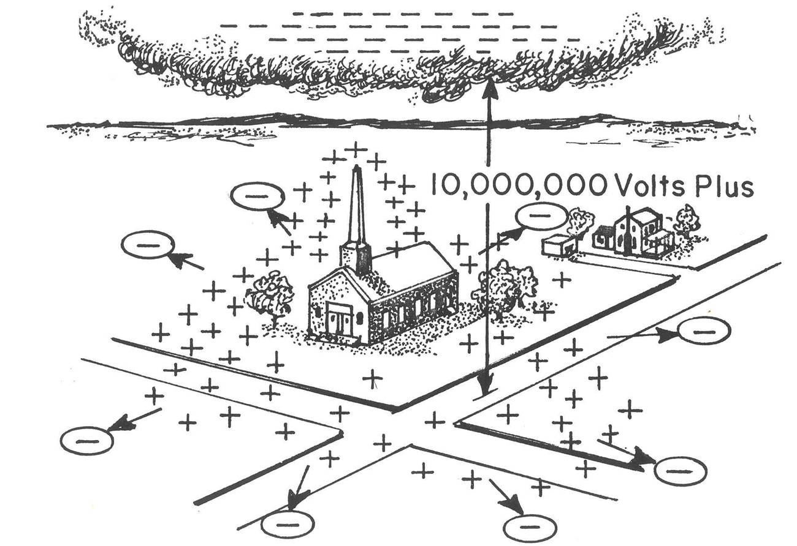
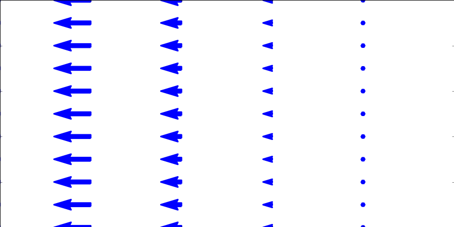

<section data-markdown>
Consider a spherical Gaussian surface. What is the $d\mathbf{A}$ in $\int\int\mathbf{E}\cdot d\mathbf{A}$?

1. $r d\theta d\phi \hat{r}$
2. $r^2 d\theta d\phi \hat{r}$
3. $r \sin \theta d\theta d\phi \hat{r}$
4. $r^2 \sin \theta d\theta d\phi \hat{r}$
5. Something else

Note:
* Correct Answer: D
</section>

<section data-markdown>

*Tutorial follow-up*:

Does the charge $\sigma$ on the beam line affect the particles being accelerated inside it?

1. Yes
2. No
3. ???

*Think: Why? Or why not?*

Note:
* CORRECT ANSWER: B
* There's no field inside
</section>

<section data-markdown>

*Tutorial follow-up*:

Could the charge $\sigma$ affect the electronic equipment outside the tunnel?

1. Yes
2. No
3. ???

*Think: Why? Or why not?*

Note:
* CORRECT ANSWER: A
* Definitely a field outside

</section>

<section data-markdown>

We derived that the electric field due to an infinite sheet with charge density $\sigma$ was as follows:

$$\mathbf{E}(z) = \begin{cases} \dfrac{\sigma}{2\varepsilon_0}\hat{k} & \mbox{if} & \mbox{ z > 0} \cr \dfrac{-\sigma}{2\varepsilon_0}\hat{k} & \mbox{if} & \mbox{ z < 0}\end{cases}$$

What does that tell you about the difference in the field when we cross the sheet, $\mathbf{E}(+z)-\mathbf{E}(-z)$?

1. it's zero
2. it's $\frac{\sigma}{\varepsilon_0}$
3. it's -$\frac{\sigma}{\varepsilon_0}$
4. it's +$\frac{\sigma}{\varepsilon_0} \hat{k}$
5. it's -$\frac{\sigma}{\varepsilon_0} \hat{k}$

Note:
* CORRECT ANSWER: D
* Makes for a good discussion about cross one direction versus the other

</section>

<section data-markdown>

## Electric Potential

</section>

<section data-markdown>

Which of the following two fields has zero curl?

| I | II |
|:-:|:-:|
|  |  |

1. Both do.
2. Only I is zero
3. Only II is zero
4. Neither is zero
5. ???

Note:
* CORRECT ANSWER: C
* Think about paddle wheel
* Fall 2016: 9 0 [89] 3 0
</section>

<section data-markdown>

What is the curl of the vector field, $\mathbf{v}= c\hat{\phi}$, in the region shown below?

1. non-zero everywhere
2. zero at some points, non-zero at others
3. zero curl everywhere

Note:
* CORRECT ANSWER: A

</section>

<section data-markdown>

What is the curl of this vector field, in the red region shown below?

1. non-zero everywhere in the box
2. non-zero at a limited set of points
3. zero curl everywhere shown
4. we need a formula to decide

Note:
* CORRECT ANSWER: D
* I think it's D because it depends on how the field drops off, which we haven't indicated. If it's drops off like 1/r, then it has no curl.
</section>

<section data-markdown>

What is the curl of this vector field, $\mathbf{v} = \dfrac{c}{s}\hat{\phi}$, in the red region shown below?

1. non-zero everywhere in the box
2. non-zero at a limited set of points
3. zero curl everywhere shown

</section>
