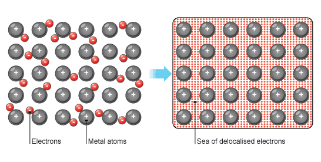

<section data-markdown>

Does system energy "superpose"?

That is, if you have one system of charges with total stored energy $W_1$, and a second charge distribution with $W_2$...if you superpose these charge distributions, is the total energy of the new system simply $W_1 + W_2$?

1. Yes
2. No

Note:
* CORRECT ANSWER: B
* Draw 4 charges and show that it is not the sum of the 2 charges and the other 2.

</section>

<section data-markdown>

## Announcements
* Homework 5 has a partner problem
  - Review problem that you share with each other
  - Can share on Piazza (for extra credit!)

* Exam 1 is Wednesday (7-9pm in A149 PSS)
</section>

<section data-markdown>

Two charges, $+q$ and $-q$, are a distance $r$ apart.  As the charges are slowly moved together, the total field energy

$$\dfrac{\varepsilon_0}{2}\int E^2 d\tau$$

1. increases
2. decreases
3. remains constant

Note:
* CORRECT ANSWER: B
* Consider when they overlap, field goes to zero, must be E gets smaller as they get closer. same volume
</section>

<section data-markdown>

A parallel-plate capacitor has $+Q$ on one plate, $-Q$ on the other.  The plates are isolated so the charge $Q$ cannot change.  As the plates are pulled apart, the total electrostatic energy stored in the capacitor:

1. increases
2. decreases
3. remains constant.

Note:
* CORRECT ANSWER: A
* Same E; constant; larger volume where it is non-zero
</section>

<section data-markdown>

### Conductors

</section>

<section data-markdown>

### The conductor problem

</section>
