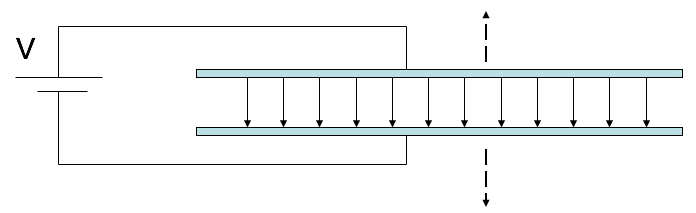
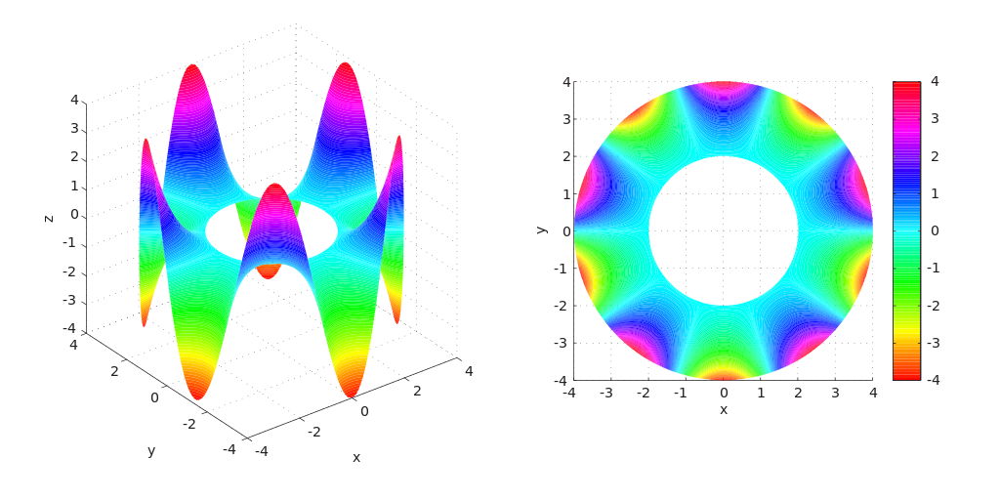

<section data-markdown>

A parallel plate capacitor is attached to a battery which maintains a constant voltage difference V between the capacitor plates.  While the battery is attached, the plates are pulled apart. The electrostatic energy stored in the capacitor

1. increases.
2. decreases.
3. stays constant.

Note:
* CORRECT ANSWER: B
* Potential same; field is reduced; but shows up squared while d is increased, overall goes down
</section>

<section data-markdown>

I feel that Exam 1 was a fair assessment.

1. Strongly Agree
2. Agree
3. Neither Agree/Disagree
4. Disagree
5. Strongly Disagree

</section>

<section data-markdown>

I feel that Exam 1 was aligned with what we have been doing (in class and on homework).

1. Strongly Agree
2. Agree
3. Neither Agree/Disagree
4. Disagree
5. Strongly Disagree

</section>

<section data-markdown>

### Laplace's Equation

</section>

<section data-markdown>

A region of space contains no charges. What can I say about $V$ in the interior?

1. Not much, there are lots of possibilities for $V(r)$ in there
2. $V(r)=0$ everywhere in the interior.
3. $V(r)=$constant everywhere in the interior

Note:
* CORRECT ANSWER: A

</section>

<section data-markdown>

A region of space contains no charges. The boundary has V=0 everywhere.
What can I say about $V$ in the interior?

1. Not much, there are lots of possibilities for $V(r)$ in there
2. $V(r)=0$ everywhere in the interior.
3. $V(r)=$constant everywhere in the interior

Note:
* CORRECT ANSWER: B

</section>

<section data-markdown>

If you put a positive test charge at the center of this cube of charges, could it be in stable equilibrium?

1. Yes
2. No
3. ???

Note:
* CORRECT ANSWER: B

</section>
