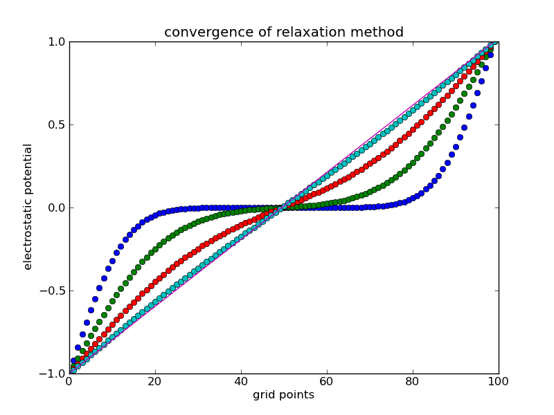

<section data-markdown>

If you put a positive test charge at the center of this cube of charges, could it be in stable equilibrium?

1. Yes
2. No
3. ???

Note:
* CORRECT ANSWER: B

</section>

<section data-markdown>

### Method of Relaxation

</section>

<section data-markdown>

Consider a function $f(x)$ that is both continuous and continuously differentiable over some domain. Given a step size of $a$, which could be an approximate derivative of this function somewhere in that domain? $df/dx \approx$

1. $f(x_i+a) - f(x_i)$
2. $f(x_i) - f(x_i-a)$
3. $\frac{f(x_i+a) - f(x_i)}{a}$
4. $\frac{f(x_i) - f(x_i-a)}{a}$
5. More than one of these

Note:
* Correct Answer: E (C and D)
</section>

<section data-markdown>
If we choose to use:

$$\dfrac{df}{dx} \approx \dfrac{f(x_i+a) - f(x_i)}{a}$$

Where are we computing the approximate derivative?

1. $a$
2. $x_i$
3. $x_i + a$
4. Somewhere else

Note:
* Correct Answer: D (it's halfway between)

</section>

<section data-markdown>

Taking the second derivative of $f(x)$ discretely is as simple as applying the discrete definition of the derivative,

$$f''(x_i) \approx \dfrac{f'(x_i + a/2) - f'(x_i - a/2)}{a}$$

Derive the second derivative in terms of $f$.

</section>

<section data-markdown>

To investigate the convergence, we must compare the estimate of $V$ before and after each calculation. For our 1D relaxation code, $V$ will be a 1D array. For the kth estimate, we can compare $V_k$ against its previous value by simply taking the difference.

Store this in a variable called ``err``. What is the type for ``err``?

1. A single number
2. A 1D array
3. A 2D array
4. ???

Note:
* Coreect Answer: B

</section>
