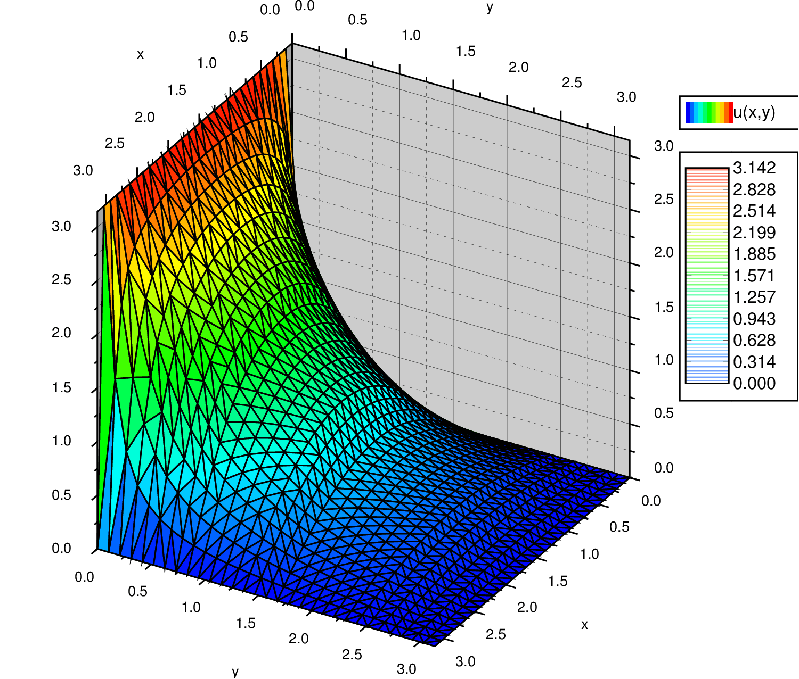

<section data-markdown>

The Method of Relaxation also works for Poisson's equation (i.e., when there is charge!).

Given, $\nabla^2 V \approx \dfrac{V(x+a)-2V(x)+V(x-a)}{a^2}$

Which equations describes the appropriate "averaging" that we must do:

1. $V(x) = \dfrac{1}{2}(V(x+a)-V(x-a))$
2. $V(x) = \dfrac{\rho(x)}{\varepsilon_0}+\dfrac{1}{2}(V(x+a)+V(x-a))$
3. $V(x) = \dfrac{a^2\rho(x)}{2\varepsilon_0}+\dfrac{1}{2}(V(x+a)+V(x-a))$

Note:
* Correct answer: C

</section>

<section data-markdown>

### Separation of Variables (Cartesian)

</section>

<section data-markdown>

Say you have three functions $f(x)$, $g(y)$, and $h(z)$.
$f(x)$  depends on $x$ but not on $y$ or $z$.
$g(y)$ depends on $y$ but not on $x$ or $z$.
$h(z)$ depends on $z$ but not on $x$ or $y$.

If $f(x) + g(y) + h(z) = 0$ for all $x$, $y$, $z$, then:

1. All three functions are constants (i.e. they do not depend on $x$, $y$, $z$ at all.)
2. At least one of these functions has to be zero everywhere.
3. All of these functions have to be zero everywhere.
4. All three functions have to be linear functions in $x$, $y$, or $z$ respectively (such as $f(x)=ax+b$)

Note:
* CORRECT ANSWER: A

</section>

<section data-markdown>

If our general solution contains the function,

$$X(x) = Ae^{\sqrt{c}x} + Be^{-\sqrt{c}x}$$

What does our solution look like if $c<0$; what about if $c>0$?

1. Exponential; Sinusoidal
2. Sinusoidal; Exponential
3. Both Exponential
4. Both Sinusoidal
5. ???

Note:
* CORRECT ANSWER: B

</section>

<section data-markdown>

Our example problem has the following boundary conditions:

* $V(0,y>0) = 0; V(a,y>0) = 0$
* $V(x_{0\rightarrow a},y=0) = V_0; V(x,y\rightarrow \infty) = 0$

If $X''= c_1 X$ and $Y'' = c_2Y$ with $c_1 + c_2 = 0$, which is constant is positive?

1. $c_1$
2. $c_2$
3. It doesn't matter either can be

Note:
* CORRECT ANSWER: B
</section>
