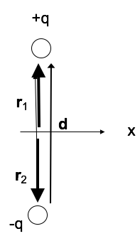
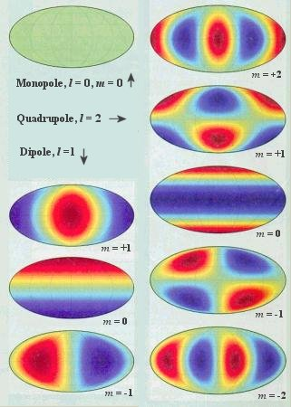

<section data-markdown>

How many boundary conditions (on the potential $V$) do you use to find $V$ inside the spherical plastic shell?

1. 1
2. 2
3. 3
4. 4
5. It depends on $V_0(\theta)$

Note:
* CORRECT ANSWER: B
* Good for discussion; obviously you need the surface BC, but what about at r=0? Is that technically a BC?
</section>

<section data-markdown>

## Announcements

* Homework 8 has 2D relaxation problem
  - It is OK to post code on piazza and get help
  - Solution to HW7 problem 5 (1D relaxation) is linked (you may work from it)
* DC out of town Monday; Norman Birge will cover

</section>

<section data-markdown>

Two charges are positioned as shown to the left. The relative position vector between them is $\mathbf{d}$. What is the value of of the dipole moment? $\sum_i q_i \mathbf{r}_i$

1. $+q\mathbf{d}$
2. $-q\mathbf{d}$
3. Zero
4. None of these

Note:
* CORRECT ANSWER: A

</section>

<section data-markdown>

## Multipole Expansion

Multipole Expansion of the Power Spectrum of CMBR

Note: The radiation from cosmic microwave background can be described in terms of contributions using a basis of functions with increasing smaller contributions.

</section>
