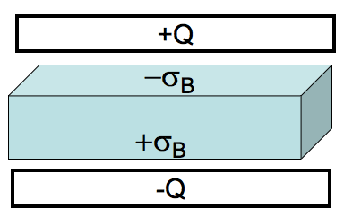
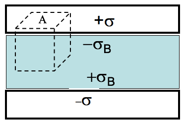
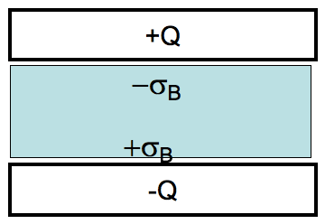

<section data-markdown>

When there are no free charges, $\rho_{free}$ = 0, in a linear dielectric material, the electric potential, $V$, in that material satisfies Laplace's equation?

$$\nabla^2 V = 0$$

1. True
2. False
3. ???

Note:
* CORRECT ANSWER: A
* As we will show later.

</section>

<section data-markdown>

A very large (effectively infinite) capacitor has charge $Q$. A neutral (*homogeneous*) dielectric is inserted into the gap (and of course, it will polarize). We want to find $\mathbf{E}$ everywhere.

Which equation would you head to first?

1. $\mathbf{D} = \varepsilon_0 \mathbf{E} + \mathbf{P}$
2. $\oint \mathbf{D}\cdot d\mathbf{A} = Q_{free}$
3. $\oint \mathbf{E}\cdot d\mathbf{A} = \frac{Q}{\varepsilon_0}$
4. More than one of these would work
5. Can't solve unless we know the dielectric is linear.

Note:
* CORRECT ANSWER: E
* If you don’t know it’s *linear*, then knowing D is not enough to determine E. (Even if it’s still x-y symmetric/infinite, you still don’t know how much it polarizes!)

</section>

<section data-markdown>

A very large (effectively infinite) capacitor has charge $Q$. A neutral (*homogeneous*) dielectric is inserted into the gap (and of course, it will polarize). We want to find $\mathbf{D}$ everywhere.

Which equation would you head to first?

1. $\mathbf{D} = \varepsilon_0 \mathbf{E} + \mathbf{P}$
2. $\oint \mathbf{D}\cdot d\mathbf{A} = Q_{free}$
3. $\oint \mathbf{E}\cdot d\mathbf{A} = \frac{Q}{\varepsilon_0}$
4. More than one of these would work

Note:
* CORRECT ANSWER: B
* The amount of free charge is known!

</section>

<section data-markdown>

An  ideal (large) capacitor has charge $Q$. A neutral linear dielectric is inserted into the gap. We want to find $\mathbf{D}$ in the dielectric.

$$\oint \mathbf{D}\cdot d\mathbf{A} = Q_{free}$$

For the Gaussian pillbox shown, what is $Q_{free,enclosed}$?

1. $\sigma A$
2. $-\sigma_B A$
3. $(\sigma-\sigma_B) A$
4. $(\sigma+\sigma_B) A$
5. Something else

Note:
* CORRECT ANSWER: A

</section>

<section data-markdown>

An  ideal (large) capacitor has charge $Q$. A neutral linear dielectric is inserted into the gap. We want to find $\mathbf{D}$ in the dielectric.

$$\oint \mathbf{D}\cdot d\mathbf{A} = Q_{free}$$

Is $\mathbf{D}$ zero INSIDE the metal? (i.e., on the top face of our cubical Gaussian surface)

1. It must be zero in there.
2. It depends.
3. It is definitely not zero in there.

Note:
* CORRECT ANSWER: A

</section>

<section data-markdown>

An  ideal (large) capacitor has charge $Q$. A neutral linear dielectric is inserted into the gap. We want to find $\mathbf{D}$ in the dielectric.

$$\oint \mathbf{D}\cdot d\mathbf{A} = Q_{free}$$

What is $|\mathbf{D}|$ in the dielectric?

1. $\sigma$
2. $2\sigma$
3. $\sigma/2$
4. $\sigma+\sigma_b$
5. Something else

Note:
* CORRECT ANSWER: A

</section>

<section data-markdown>

An ideal (large) capacitor has charge $Q$. A neutral linear dielectric is inserted into the gap. Now that we have $\mathbf{D}$ in the dielectric, what is $\mathbf{E}$ inside the dielectric?

1. $\mathbf{E} = \mathbf{D} \varepsilon_0 \varepsilon_r$
2. $\mathbf{E} = \mathbf{D}/\varepsilon_0 \varepsilon_r$
3. $\mathbf{E} = \mathbf{D} \varepsilon_0$
4. $\mathbf{E} = \mathbf{D}/\varepsilon_0$
5. Not so simple! Need another method

Note:
* CORRECT ANSWER: B

</section>
