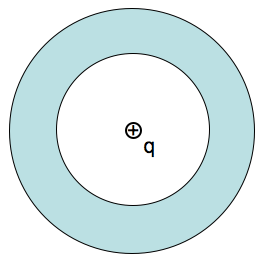

<section data-markdown>

A point charge $+q$ is placed at the center of a neutral, linear, homogeneous, dielectric teflon shell. Can $\mathbf{D}$ be computed from its divergence?

$$\oint \mathbf{D} \cdot d\mathbf{A} = Q_{free}$$

1. Yes
2. No
3. Depends on other things not given

</section>

<section data-markdown>

A point charge $+q$ is placed at the center of a neutral, linear, homogeneous, dielectric **hemispherical** shell. Can $\mathbf{D}$ be computed from its divergence?

$$\oint \mathbf{D} \cdot d\mathbf{A} = Q_{free}$$

1. Yes
2. No
3. Depends on other things not given

</section>

<section data-markdown>

## Boundary Conditions

</section>

<section data-markdown>

## Why are these boundary conditions useful?

</section>

<section data-markdown>

In the boundary condition for $E_{\perp}$, the difference across the boundary is $\dfrac{\sigma}{\varepsilon_0}.$ What does that $\sigma$ contain?

1. Just $\sigma_{f}$
2. Just $\sigma_{b}$
3. Both
4. Something else

Note: Correct answer C

</section>

<section data-markdown>

Let's assume the normal vector at the material boundary points upward.

What the sign of the dot product of the electric field and this normal vector above and below the boundary (i.e., $\mathbf{E}\cdot\mathbf{n}$)?

1. Above is positive; below is negative
2. Above is negative; below is negative
3. Above is negative; below is positive
4. Above is positive; below is positive

Note: Correct answer B

</section>
