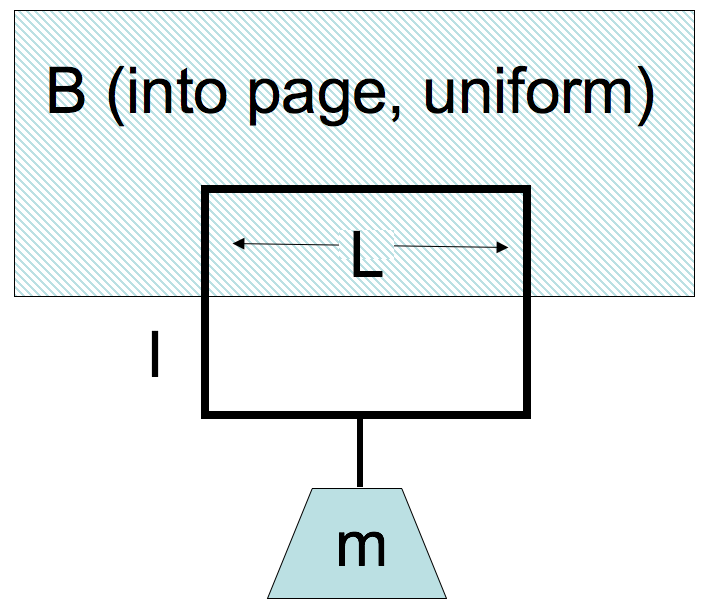

<section data-markdown>

A wire loop in a $B$ field has a current $I$. The B-field is localized, it's only in the hatched region, roughly zero elsewhere. Which way is $I$ flowing to hold the mass in place?

1. Clockwise
2. Counter-clockwise
3. You cannot "levitate" like this!

Note:
* CORRECT ANSWER: A

</section>

<section data-markdown>

I feel that Exam 2 was a fair assessment.

1. Strongly Agree
2. Agree
3. Neither Agree/Disagree
4. Disagree
5. Strongly Disagree

</section>

<section data-markdown>

I feel that Exam 2 was aligned with what we have been doing (in class and on homework).

1. Strongly Agree
2. Agree
3. Neither Agree/Disagree
4. Disagree
5. Strongly Disagree

</section>

<section data-markdown>

I felt better prepared for Exam 2 thank Exam 1.

1. Strongly Agree
2. Agree
3. Neither Agree/Disagree
4. Disagree
5. Strongly Disagree

</section>

<section data-markdown>

In the first stage of the mass spectrometer, with $\mathbf{E} = E_0 \hat{z}$ (pointing upward) and $\mathbf{B} = B_0 \hat{x}$ (pointing out of the page), which particles travel through in a straight line?

1. All particles regardless of speed
2. Particles with speed $B_0/E_0$
3. Particles with speed $E_0/B_0$
4. Can't tell without knowing $q$ and/or $m$

*You may assume all particles move exclusively in the +y direction.*

Note:
* CORRECT ANSWER: C

</section>

<section data-markdown>

If we place a physical filter (i.e., a piece of metal with a thin slot that is a bit larger than the beam width to avoid diffraction) at the end of the first stage, which particles (assume they are all positively charged) hit the upper-part of the filter? Which hit the lower part?

1. Fast moving particles hit the upper part; slow ones hit the lower part
2. Slow moving particles hit the upper part; fast ones hit the lower part
3. It's not possible to tell without $q$ and/or $m$

Note:
* CORRECT ANSWER: B

</section>

<section data-markdown>

Can we use the same mass spectrometer set up for negatively and positively charged particles? That is, will our set up distinguish between particles of a given mass and differently-signed charges?

1. Yes
2. No

Note:
* CORRECT ANSWER: A
</section>

<section data-markdown>

For our velocity selector where $\mathbf{E}=E_0\hat{z}$ and $\mathbf{B} = B_0 \hat{x}$ and we start particles from rest, we end up with the following **coupled** equations of motion,

$$m\dot{v}_y = q v_z B_0$$
$$m\dot{v}_z = q E_0 - q v_y B_0$$

How might we solve them for $y(t)$ and $z(t)$?

1. Just integrate the equations of motion
2. Guess the general solution
3. Take the time derivative of one and plug into the other
4. Give up???

</section>

<section data-markdown>

Positive ions flow right through a liquid, negative ions flow left. The spatial density and speed of both ions types are identical. Is there a net current through the liquid?

1. Yes, to the right
2. Yes, to the left
3. No
4. Not enough information given

Note:
* CORRECT ANSWER: A

</section>

<section data-markdown>

Current $I$ flows down a wire (length $L$) with a square cross section (side $a$). If it is uniformly distributed over the entire wire area, what is the magnitude of the volume current density $J$?

1. $J = I/a^2$
2. $J = I/a$
3. $J = I/4a$
4. $J = a^2I$
5. None of the above

Note:
* CORRECT ANSWER: A

</section>
