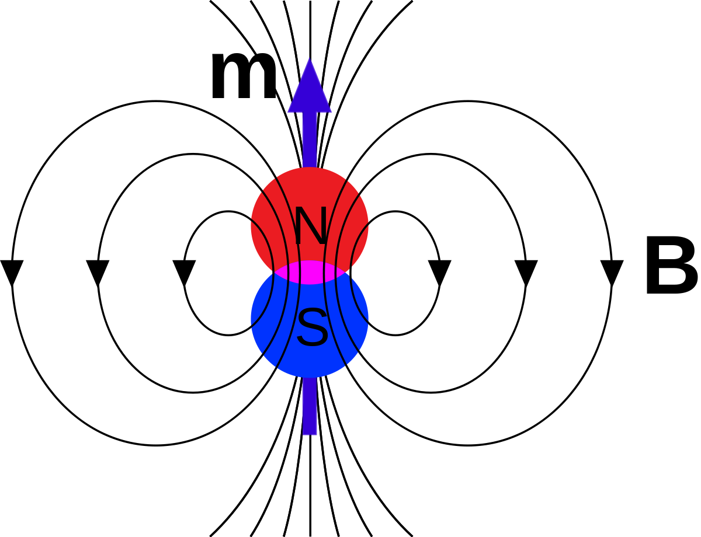
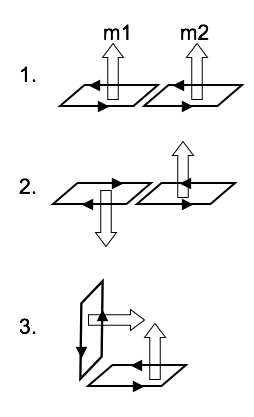

<section data-markdown>

What is the physical interpretation of $\oint \mathbf{A} \cdot d\mathbf{l}$?

1. The current density $\mathbf{J}$
2. The magnetic field $\mathbf{B}$
3. The magnetic flux $\Phi_B$
4. It's none of the above, but is something simple and concrete
5. It has no particular physical interpretation at all

Note:
* CORRECT ANSWER: C

</section>

<section data-markdown>
## Announcements

* Final Exam: Tuesday Dec 11th
  * 12:45pm-2:45pm
  * In this room (BPS 1415)
  * See me for accomodations
  * Details on Monday

</section>

<section data-markdown>
## Magnetic Dipoles

</section>

<section data-markdown>
The leading term in the vector potential multipole expansion involves:

$\oint d\mathbf{l}'$

What is the magnitude of this integral?

1. $R$
2. $2\pi R$
3. 0
4. Something entirely different/it depends!

Note:
* CORRECT ANSWER: C

</section>

<section data-markdown>

Two magnetic dipoles $m_1$ and $m_2$ (equal in magnitude) are oriented in three different ways.

Which ones can produce a dipole field at large distances?

1. None of these
2. All three
3. 1 only
4. 1 and 2 only
5. 1 and 3 only

Note:
* CORRECT ANSWER: E

</section>

<section data-markdown>

Two magnetic dipoles $m_1$ and $m_2$ (**unequal** in magnitude) are oriented in three different ways.

Which ones can produce a dipole field at large distances?

1. None of these
2. All three
3. 1 only
4. 1 and 2 only
5. 1 and 3 only

Note:
* CORRECT ANSWER: B

</section>

<section data-markdown>

## Magnets, how do they work?

[Insane Clown Posse - Miracles](https://www.youtube.com/watch?v=_-agl0pOQfs)
</section>

<section data-markdown>

## Paramagnetism & Magnetic Domains

</section>
