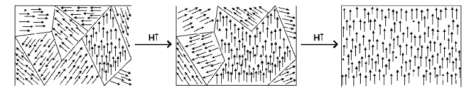
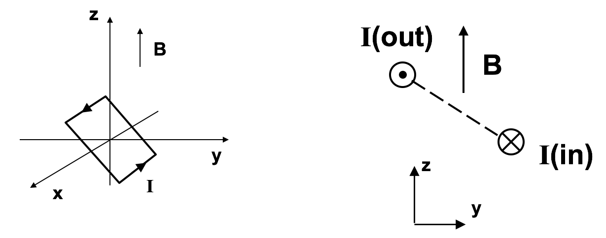
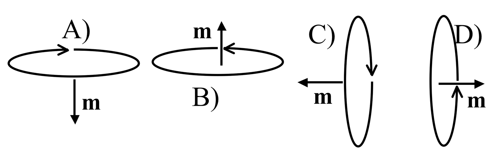

<section data-markdown>

Two magnetic dipoles $m_1$ and $m_2$ (**unequal** in magnitude) are oriented in three different ways.

Which ones can produce a dipole field at large distances?

1. None of these
2. All three
3. 1 only
4. 1 and 2 only
5. 1 and 3 only

Note:
* CORRECT ANSWER: B

</section>

<section data-markdown>

## Magnets, how do they work?

[Insane Clown Posse - Miracles](https://www.youtube.com/watch?v=_-agl0pOQfs)
</section>

<section data-markdown>

## Paramagnetism & Magnetic Domains

</section>

<section data-markdown>

The force on a segment of wire $L$ is $\mathbf{F} = I \mathbf{L} \times \mathbf{B}$ A current-carrying wire loop is in a constant magnetic field $\mathbf{B} = B \hat{z}$ as shown. What is the direction of the torque on the loop?

1. Zero
2. +x
3. +y
4. +z
5. None of these

Note:
* CORRECT ANSWER: B
</section>

<section data-markdown>

The torque on a magnetic dipole in a B field is:

$\mathbf{\tau} = \mathbf{m} \times \mathbf{B}$

How will a small current loop line up if the B field points uniformly up the page?

</section>

<section data-markdown>

Suppose I place a small dipole $\mathbf{M}$ at various locations near the end of a large solenoid. At which point is the magnitude of the force on the dipole greatest?

D) Not enough information to answer

E) There is no net force on a dipole

Recall: $\mathbf{F} = \nabla (\mathbf{m}\cdot\mathbf{B})$

Note:
* CORRECT ANSWER: B

</section>

<section data-markdown>

Consider a paramagnetic material placed in a uniform external magnetic field, $\mathbf{B}_{ext}$. The paramagnetic magnetizes, so that the total magnetic field just outside the material is now...

1. smaller than
2. larger than
3. the same as

it was before the material was placed.

Note:
* Correct Answer: B

</section>

<section data-markdown>

In our model of diamagnetism, the electron (charge, $-e$) travels around the "loop" in a time,

$$T = \dfrac{2 \pi R}{v}.$$

What is the magnitude of magnetic dipole moment of this arrangement?

1. $evR$
2. $\dfrac{evR}{2}$
3. ${evR^2}$
4. $\dfrac{evR^2}{2}$
5. Something else?

Note:
* Correct Answer: B
</section>

<section data-markdown>

In our model of diamagnetism, let the angular momentum associated with the orbiting electron point in the $+z$ direction.

What is the direction of the magnetic moment?

1. Also $+z$
2. $-z$
3. It depends

Note:
* Correct Answer: B
</section>
