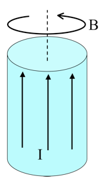

<section data-markdown>

Predict the results of the following experiment: a paramagnetic bar and a diamagnetic bar are pushed inside of a solenoid.

1. The paramagnet is pushed out, the diamagnet is sucked in
2. The diamagnet is pushed out, the paramagnet is sucked in
3. Both are sucked in, but with different force
4. Both are pushed out, but with different force

Note:
* CORRECT ANSWER: B

</section>

<section data-markdown>
## Announcements

* Final Exam!
  * 12:45-2:45pm, Tues Dec. 12
  * In this room (1415 BPS)

</section>

<section data-markdown>
## What's on the final exam?

* A few true/false questions about $\mathbf{B}$, $\mathbf{H}$, and Ampere's Law
* Determine bound charge, $\mathbf{E}$, $\mathbf{D}$ for some material ($\mathbf{P}$), and explain how quantities might change
* Determine and explain the direction of the force between two dipoles in some configuration
* Determine the $\mathbf{B}$ for some $\mathbf{J}$
* Determine bound currents, $\mathbf{B}$, and $\mathbf{H}$ for some material with a "simple" free current, and explain properties of the bound currents

</section>

<section data-markdown>

A very long aluminum (paramagnetic!) rod carries a uniformly distributed current $I$ along the $+z$ direction.
What is the direction of the bound volume current?

1. $\mathbf{J}_B$ points parallel to $I$
2. $\mathbf{J}_B$ points anti-parallel to $I$
3. It’s zero!
4. Other/not sure

Note:
* CORRECT ANSWER: A

</section>

<section data-markdown>

A very long aluminum (paramagnetic!) rod carries a uniformly distributed current $I$ along the $+z$ direction. We know $\mathbf{B}$ will be CCW as viewed from above. (Right?) What about $\mathbf{H}$ and $\mathbf{M}$ inside the cylinder?

1. Both are CCW
2. Both are CW
3. $\mathbf{H}$ is CCW, but $\mathbf{M}$ is CW
4. $\mathbf{H}$ is CW, $\mathbf{M}$ is CCW
5. ???

Note:
* CORRECT ANSWER: A
</section>

<section data-markdown>

A very long aluminum (paramagnetic!) rod carries a uniformly distributed current $I$ along the $+z$ direction. What is the direction of the bound volume current?

1. $\mathbf{J}_B$ points parallel to $I$
2. $\mathbf{J}_B$ points anti-parallel to $I$
3. It’s zero!
4. Other/not sure

Note:
* CORRECT ANSWER: A

</section>

<section data-markdown>

A very long aluminum (paramagnetic!) rod carries a uniformly distributed current $I$ along the $+z$ direction. What is the direction of the bound surface current?

1. $\mathbf{K}_B$ points parallel to $I$
2. $\mathbf{K}_B$ points anti-parallel to $I$
3. Other/not sure

Note:
* CORRECT ANSWER: B
</section>

<section data-markdown>

For linearly magnetizable materials, the relationship between the magnetization and the H-field is,

$\mathbf{M} = \chi_m \mathbf{H}$

What do you expect the sign of $X_m$ to be for a paramagnetic/diamagnetic material?

1. para: $\chi_m<0 \;$ dia: $\chi_m>0$
2. para: $\chi_m>0 \;$ dia: $\chi_m<0$
3. Both positive
4. Both negative

Note:
Correct answer: B

</section>
